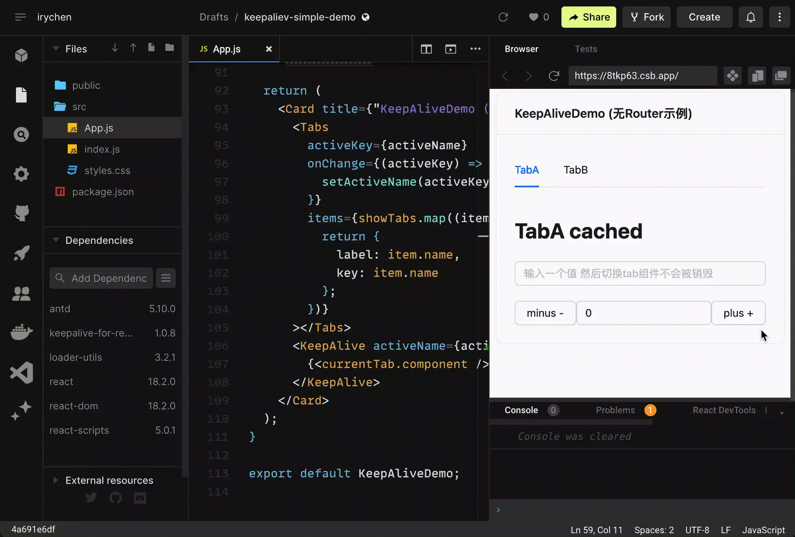

# KeepAlive for React

中文 | [English](./README.md) 

## 介绍

像 Vue 中的 keep-alive 一样的 React KeepAlive 组件

### 注意⚠️!

不要使用 <React.StrictMode />，它在开发模式下无法与 keepalive-for-react 一起工作。因为当你使用 keepalive-for-react 的 useOnActive 钩子时，它可能会导致一些意外的行为。

## 特性

- 在页面中大幅减少 DOM 元素的数量
- 支持缓存组件状态
- 简单实现，无需任何额外依赖和黑客手段
- 支持自定义缓存规则
- 高性能，无性能损失
- 易于使用，只需包装你想要缓存的组件

## 用法

### 安装

#### npm
```bash
npm install --save keepalive-for-react 
```

#### yarn
```bash
yarn add keepalive-for-react 
```

#### pnpm
```bash
pnpm add keepalive-for-react 
```


### 搭配路由使用 ( 复杂用法 )

请查看 layout component 源码示例 [admin example](https://github.com/irychen/super-admin/blob/main/src/layout/index.tsx)

或者直接查看项目 [super admin](https://github.com/irychen/super-admin)

### 简单用法例子

[Link: codesandbox Demo](https://codesandbox.io/s/keepaliev-simple-demo-8tkp63?file=/src/App.js)



```tsx
import { Card, Input, Tabs } from "antd"
import { useMemo, useState } from "react"
import KeepAlive, { useOnActive } from "keepalive-for-react"

function KeepAliveDemo() {
    const keepAliveRef = useRef<KeepAliveRef>(null)
    const [activeName, setActiveName] = useState("TabA")
    const showTabs = [
        {
            name: "TabA",
            component: TabA,
            cache: true,
        },
        {
            name: "TabB",
            component: TabB,
            cache: false,
        },
    ]
  
    const currentTab = useMemo(() => {
        return showTabs.find(item => item.name === activeName)!
    }, [activeName])
  
    const clearAllCache = () => {
        keepAliveRef.current?.cleanAllCache()
    }
    
    const getCaches = () => {
        console.log(keepAliveRef.current?.getCaches())
    }
    
    const removeCache = () => {
        keepAliveRef.current?.removeCache("TabA")
    }
    
    const cleanOtherCache = () => {
        keepAliveRef.current?.cleanOtherCache()
    }

    return (
        <Card title={"KeepAliveDemo (无Router示例)"}>
            <Tabs
                activeKey={activeName}
                onChange={activeKey => {
                    setActiveName(activeKey)
                }}
                items={showTabs.map(item => {
                    return {
                        label: item.name,
                        key: item.name,
                    }
                })}
            ></Tabs>
            <KeepAlive
              aliveRef={keepAliveRef}
              activeName={activeName} 
              cache={currentTab.cache}>
                {<currentTab.component />}
            </KeepAlive>
        </Card>
    )
}

function TabA() {
    const domRef = useOnActive(() => {
        console.log("TabA onActive") // this will be trigger when tabA is active
    })
    return (
        <div ref={domRef}>
            <h1 className={"py-[15px] font-bold"}>TabA cached</h1>
            <Input placeholder="输入一个值 然后切换tab组件不会被销毁"></Input>
        </div>
    )
}

function TabB() {
    const domRef = useOnActive(() => {
        console.log("TabB onActive") // no cache won't trigger onActive
    })
    return (
        <div ref={domRef}>
            <h1 className={"py-[15px] font-bold"}>TabB nocache</h1>
            <Input placeholder="输入一个值 然后切换tab组件会被销毁"></Input>
        </div>
    )
}

export default KeepAliveDemo
```
